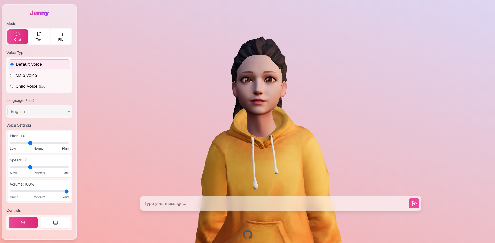

# AI 3D Avatar Chat Application



A real-time 3D avatar chat application that combines advanced AI technologies with interactive 3D graphics. The application features a lifelike 3D avatar that can engage in natural conversations, display emotions, and perform realistic lip-sync animations.

## 🌟 Features

- **3D Avatar Interaction**: Realistic 3D character with natural movements and expressions
- **AI-Powered Conversations**: Intelligent responses using advanced language models
- **Real-time Lip Sync**: Accurate mouth movements synchronized with speech
- **Emotional Expressions**: Dynamic facial expressions that match conversation context
- **Voice Synthesis**: Natural-sounding voice generation for responses
- **Interactive UI**: Modern, responsive interface with intuitive controls


## 🚀 Tech Stack

- **Frontend**: React, Three.js, Vite
- **Backend**: Node.js, Express
- **AI/ML**: OpenAI GPT, Hugging Face, ElevenLabs Voice Synthesis
- **3D Graphics**: Three.js, GLTF/GLB models
- **Real-time Communication**: WebSocket

## 🛠️ Prerequisites

- Node.js (v16 or higher)
- npm or yarn
- Git

## 📦 Installation

1. Clone the repository:
```bash
git clone https://github.com/naveed-gung/jenny
cd jenny-main
```

2. Install dependencies:
```bash
# Install backend dependencies
cd backend
npm install

# Install frontend dependencies
cd ../frontend
npm install
```

3. Set up environment variables:
   - Create `.env` files in both frontend and backend directories
   - Add necessary API keys and configuration (see Environment Variables section)

## ⚙️ Environment Variables

### Backend (.env)
```
OPENAI_API_KEY=your_openai_api_key
ELEVENLABS_API_KEY=your_elevenlabs_api_key
PORT=3001
```

### Frontend (.env)
```
VITE_API_URL=http://localhost:3001
```

## 🚀 Running the Application

1. Start the backend server:
```bash
cd backend
npm start
```

2. Start the frontend development server:
```bash
cd frontend
npm run dev
```

3. Open your browser and navigate to `http://localhost:5173`

## 🎮 Usage

1. Type your message in the chat input
2. Press Enter or click the send button
3. Watch as the avatar responds with:
   - Natural speech
   - Synchronized lip movements
   - Appropriate facial expressions
   - Body animations

## 🔧 Configuration

### Avatar Customization
- Modify the 3D model in the `frontend/src/assets/models` directory
- Adjust animation parameters in `Avatar.jsx`
- Customize facial expressions in the backend configuration

### AI Behavior
- Adjust conversation parameters in the backend
- Modify voice settings in the ElevenLabs configuration
- Fine-tune response generation in the OpenAI settings

## 🚢 Deployment

### Backend Deployment
1. Set up a Node.js environment on your hosting platform
2. Configure environment variables
3. Deploy using your preferred hosting service (e.g., Render, Heroku, AWS)

### Frontend Deployment
1. Build the frontend:
```bash
cd frontend
npm run build
```
2. Deploy the built files to your hosting service
3. Configure the production API URL

## 🤝 Contributing

1. Fork the repository
2. Create a feature branch
3. Commit your changes
4. Push to the branch
5. Create a Pull Request
