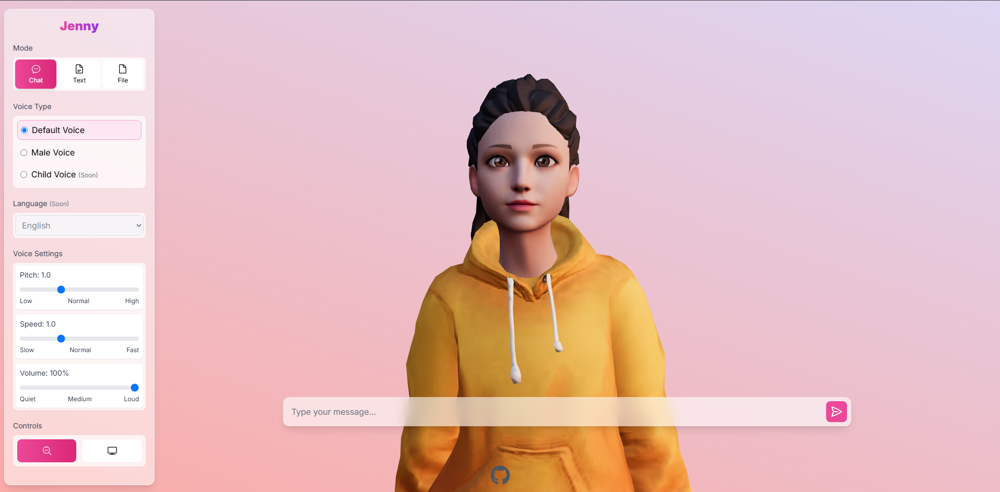

<div align="center">
  
  
  # Jenny - 3D AI Avatar Chat Application
  
  <p>
    
    
  </p>
  
  
</div>

##  Features

-  Expressive 3D avatar with synchronized lip movements
-  Text-to-speech with ElevenLabs API for natural voices
-  AI-powered conversations using Google's Gemini API
-  Multiple voice types with customizable settings
-  Adjustable voice pitch, speed, and volume

##  Demo

Check out the live demo: [Jenny AI Avatar Demo](https://jenny-90fq.onrender.com)

##  Installation & Setup

### Prerequisites
- Node.js (v14+)
- FFmpeg (for audio conversion and lip sync)

### Local Development

1. **Clone the repository**
```bash
git clone https://github.com/naveed-gung/jenny.git
cd jenny
```

2. **Install all dependencies at once**
```bash
npm run install-all
```

3. **Create a `.env` file in the backend directory with:**
```
TTS_OPEN_API_KEY=your_tts_open_api_key   # Optional, default key is provided
GEMINI_API_KEY=your_gemini_api_key
SPEECHGEN_API_KEY=your_speechgen_api_key  # Optional, for child voice
SPEECHGEN_EMAIL=your_speechgen_email      # Optional, for child voice
```

4. **Start development servers**
```bash
npm run dev
```

5. **Open your browser** and navigate to `http://localhost:5173`

##  Key Features Explained

### Lifelike Speech with Lip Sync
The avatar uses ElevenLabs' realistic voice synthesis combined with lip synchronization to create a natural speaking experience. The lip sync is powered by Rhubarb Lip Sync technology.

### Expressive Animations
Different emotions and expressions (happy, sad, surprised) are triggered based on conversational context, making interactions feel more human.

### Voice Customization
Choose from different voice types (default, male, child) and adjust pitch, speed, and volume to personalize your experience.

##  Deployment on Render

This repository includes a `render.yaml` file for easy deployment:

1. Push your code to GitHub
2. Sign up for a Render account
3. Create a new Blueprint, pointing to your repository
4. Set the required environment variables
5. Deploy and enjoy!

##  Technologies Used

- **Frontend**: React, Three.js, React Three Fiber, TailwindCSS
- **Backend**: Node.js, Express
- **APIs**: Google Gemini API, ElevenLabs API, SpeechGen API
- **3D**: GLB models, animations, Three.js

##  Contributing

Contributions are welcome! Please feel free to submit a Pull Request.

##  License

This project is licensed under the ISC License

##  Credits

Created by Naveed Sohail Gung

---

If you like this project, please give it a  on GitHub!
